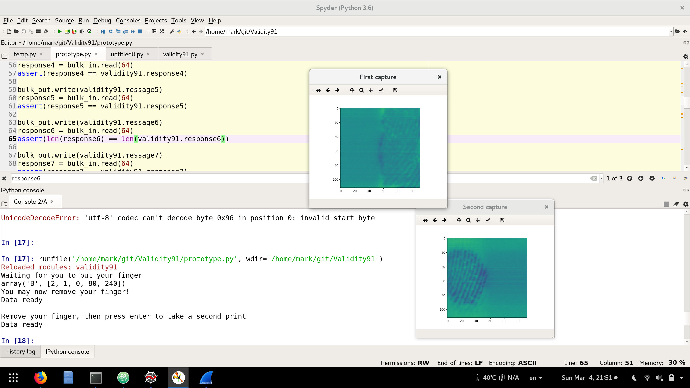

# Validity 91

This project aims at reverse engineering the protocol of the Validity 138a:0091 fingerprint sensor that is found on the XPS 15 9560 and potentially other laptops.

This sensor should be pretty straightforward to reverse engineer since apparently it doesn't encrypt the traffic between the sensor and the OS.

The main strategy is to use Wireshark and a Windows Guest OS running in VirtualBox to capture all the traffic between a working Windows implementation and the sensor.

# Getting started
## System dependencies
  1. Install libusb: `pkcon install libusb-devel`
  3. Install Wireshark: `pkcon install wireshark`
    1. Set it up to capture [USB output](https://wiki.wireshark.org/CaptureSetup/USB)
    2. Use `lsusb` to find what USB bus the fingerprint sensor is connected to:
      1. `Bus 001 Device 003: ID 138a:0091 Validity Sensors, Inc.`
  4. Install VirtualBox: `pkcon install VirtualBox`
  5. Install [VirtualBox Extension Pack](https://www.virtualbox.org/wiki/Downloads)
  6. Allow VirtualBox to run off your [existing Windows partition](https://www.serverwatch.com/server-tutorials/using-a-physical-hard-drive-with-a-virtualbox-vm.html)
    * Warning, I kinda got activation warnings from Microsoft. I think they might be related to doing this. It might be more prudent to have a seperate virtual drive running an unactivated version of Windows 10 but I just don't have the hard drive space for it.
  7. Run Windows10, and capture the fingerprint output.

Add your user to the `vboxusers` group so you can share the USB devices:

```bash
sudo usermod -a -G vboxusers $USER
```

## Python environment.
You can use conda if you like, but I provided a `Pipfile` that should make it easy to use [pipenv](https://docs.pipenv.org/).
Change to the project directory, and run

```bash
pipenv install
```

This should install spyder, as well as all the other required dependencies.


# Roadmap
| Task                                                       | Status         |
|:-----------------------------------------------------------|:---------------|
| Create a script that dumps the output from others' laptops | Not started    |
| Find the size of the image                                 | 112✕112 image  |
| Find the initialization commands                           | WOMM           |
| Find the commands required for putting the sensor to sleep | Ongoing        |
| Learn how to integrate with libfprint                      | Not started    |
| Detect when finger is put on                               | WOMM           |
| Detect when finger is taken off                            | Needs new dump |

# Reverse engineering
So I am working off a single dump using my VirtualBox and Windows10 trying to log on to my computer. Honestly, I don't know how to share the dump without making my fingerprints public on the web.

Here is a sample from the script from the side of my fingers:


## Similar projects
  * [Validity90](https://github.com/nmikhailov/Validity90) works on doing this for sensors with encrypted traffic.
  * [libfprint](https://www.freedesktop.org/wiki/Software/fprint/libfprint/) did this a while back for many sensors. Apparently we need to work toward this
